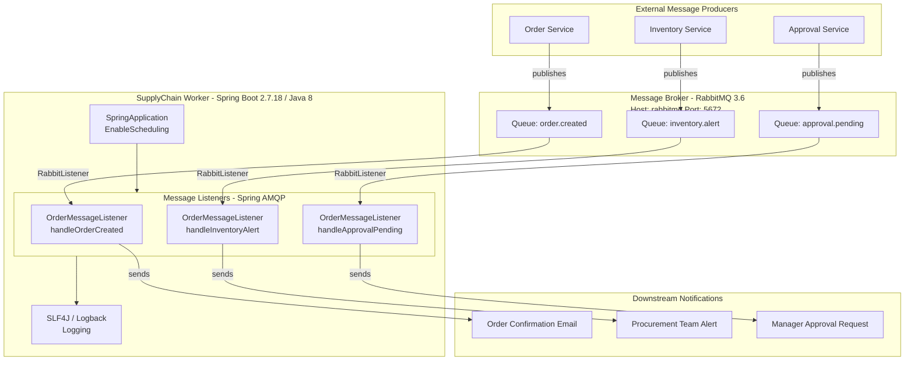

# Architecture Diagram

This diagram illustrates the high-level architecture of the SupplyChain Worker, a Spring Boot background worker that processes supply chain events from a RabbitMQ message broker.

## Application Architecture

