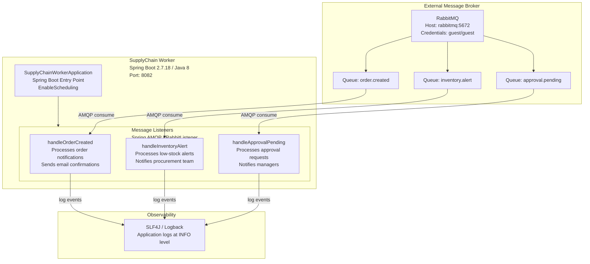

# Architecture Diagram

SupplyChain Worker is a Spring Boot background worker that listens to RabbitMQ message queues and processes supply chain events such as order notifications, inventory alerts, and approval requests.

## Application Architecture

